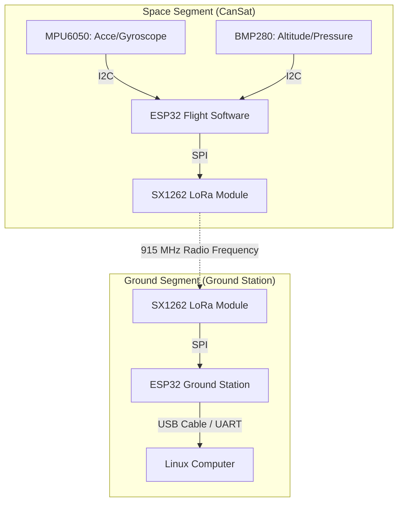
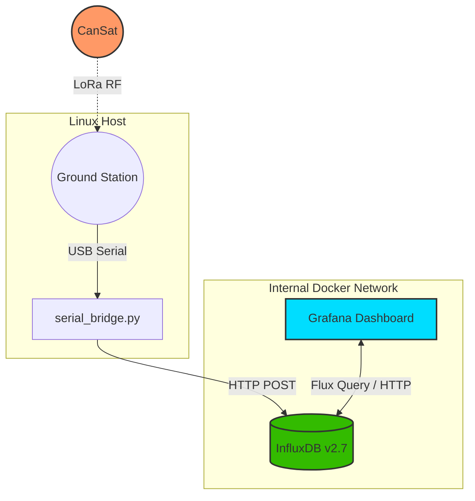
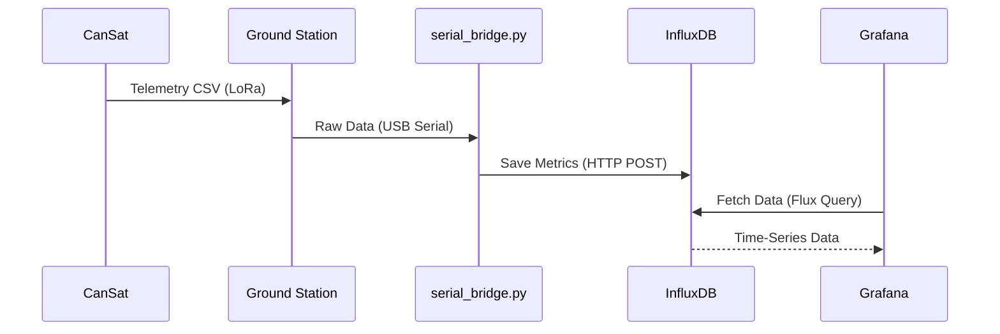

# CanSat Egg Drop Mission - Distributed Telemetry System

This repository contains the complete flight software, ground station receiver, and telemetry visualization dashboard for a CanSat "Egg Drop" mission. The system records atmospheric and inertial data in real-time, transmits it via LoRa radio frequency, and visualizes it through a distributed Docker architecture.

## Hardware Components

The physical structure of the CanSat is based on a 3D-printed chassis, specifically the [Mini-satellite CanSat](https://cults3d.com/en/3d-model/various/mini-satelite-cansat-thecrawler-2) model. The recovery system features a handmade parachute designed to stabilize the descent and protect the payload upon impact.

The electronics are divided into two segments:

**Flight Segment (CanSat):**
* ESP32 Microcontroller
* SX1262 LoRa Module (915 MHz)
* MPU6050: Accelerometer and Gyroscope
* BMP280: Barometric Pressure and Altitude Sensor

**Ground Segment (Ground Station):**
* ESP32 Microcontroller
* SX1262 LoRa Module (915 MHz)

## Technologies Used

* **C++ / Arduino:** Flight and Ground Station firmware, utilizing the `RadioLib` library for reliable LoRa communication.
* **Python 3:** Serial bridge script (`pyserial`, `influxdb-client`) designed to parse incoming CSV telemetry and inject it into the database.
* **Docker & Docker Compose:** Containerized environment for isolated, reproducible deployments across any operating system.
* **InfluxDB 2.7:** Time-series database optimized for high-frequency telemetry ingestion.
* **Grafana:** Advanced visualization platform for real-time mission monitoring.

## System Architecture

### 1. Component Overview


### 2. Network Integration


### 3. Data Flow


## Prerequisites

Before deploying the system, ensure the following requirements are met on the host machine:
* Arduino IDE (with ESP32 board definitions and `RadioLib`, `Adafruit_MPU6050`, `Adafruit_BMP280` libraries installed).
* Python 3.8+ and `pip`.
* Docker and Docker Compose plugin.

## Installation and Execution

### 1. Hardware Setup
1. Upload `flight_software.ino` to the CanSat ESP32.
2. Upload `ground_station.ino` to the Ground Station ESP32.
3. Keep the Ground Station ESP32 connected to the computer via USB. Ensure the Arduino Serial Monitor is closed to avoid port blocking.

### 2. Software Setup
Navigate to the `telemetry_dashboard` directory and start the Docker containers:

```bash
cd telemetry_dashboard
docker-compose up -d
```

Create the Python virtual environment and install dependencies:

```bash
python3 -m venv venv
source venv/bin/activate
pip install influxdb-client pyserial
```

### 3. Mission Control Initialization
Run the serial bridge to start capturing data from the Ground Station. Note that the default port is `/dev/ttyUSB0` for Linux:

```bash
python serial_bridge.py
```

Finally, open a web browser and navigate to `http://localhost:3000` to access Grafana. Configure InfluxDB (`http://cansat_influxdb:8086`) as the data source to begin visualizing the flight telemetry.
