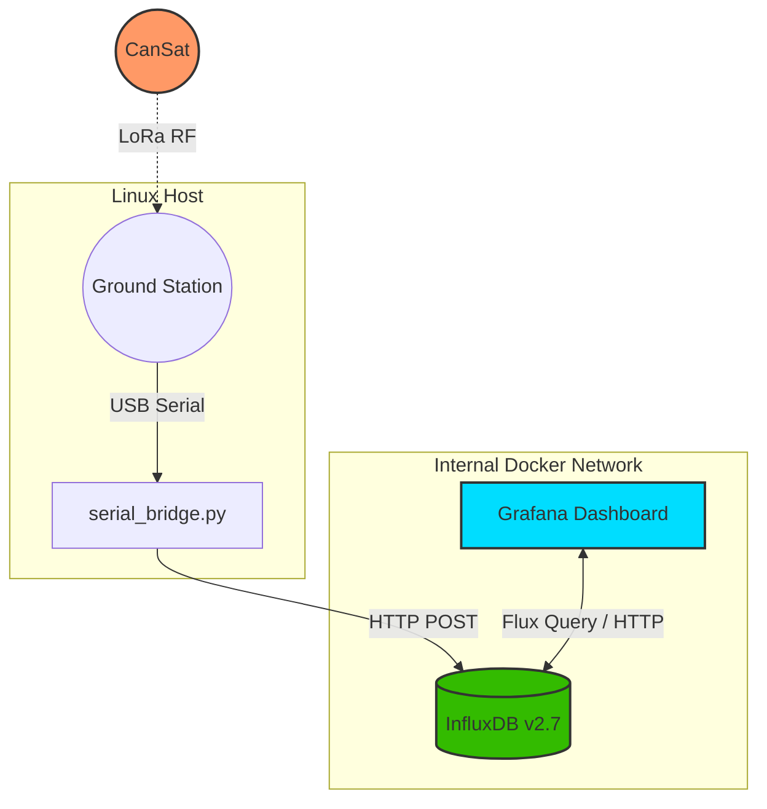

# Architecture Diagram (Software & Network)
Shows how software technologies integrate within the ground PC. 

```mermaid
graph TD
    CANSAT((CanSat)) -.->|LoRa RF| GS((Ground Station))
    
    subgraph "Linux Host"
        GS -->|USB Serial| BRIDGE[serial_bridge.py]
    end

    subgraph "Internal Docker Network"
        INFLUX[(InfluxDB v2.7)]
        GRAFANA[Grafana Dashboard]
    end

    BRIDGE -->|HTTP POST| INFLUX
    GRAFANA <-->|Flux Query / HTTP| INFLUX

    style CANSAT fill:#f96,stroke:#333,stroke-width:2px
    style INFLUX fill:#3b0,stroke:#333,stroke-width:2px
    style GRAFANA fill:#0df,stroke:#333,stroke-width:2px
```
