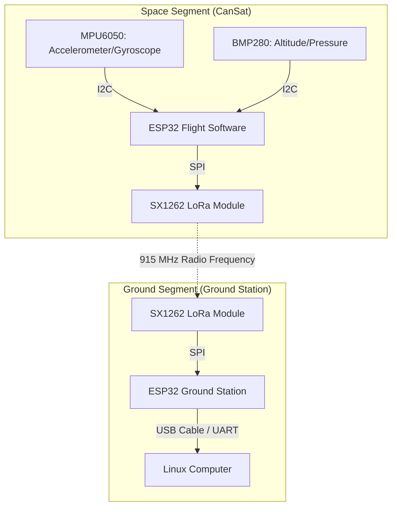

# Component Diagram (Hardware)
Shows the physical connections and communication interfaces between sensors and microcontrollers.

```mermaid
graph TD
    subgraph "Space Segment (CanSat)"
        MPU[MPU6050: Accelerometer/Gyroscope]
        BMP[BMP280: Altitude/Pressure]
        ESP_TX[ESP32 Flight Software]
        LORA_TX[SX1262 LoRa Module]
        
        MPU --> |I2C| ESP_TX
        BMP --> |I2C| ESP_TX
        ESP_TX --> |SPI| LORA_TX
    end

    subgraph "Ground Segment (Ground Station)"
        LORA_RX[SX1262 LoRa Module]
        ESP_RX[ESP32 Ground Station]
        PC[Linux Computer]

        LORA_RX --> |SPI| ESP_RX
        ESP_RX --> |USB Cable / UART| PC
    end

    LORA_TX -.-> |915 MHz Radio Frequency| LORA_RX
```
