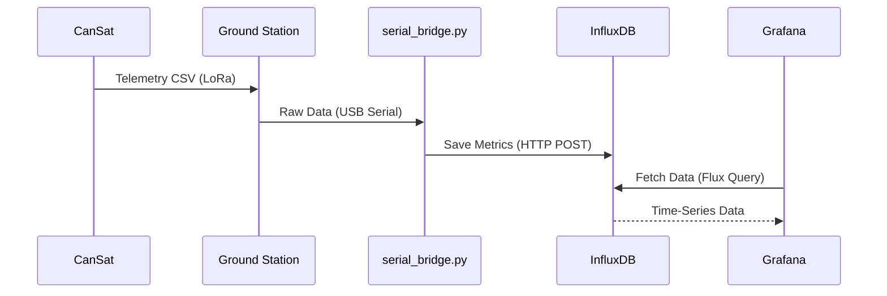

# Data Flow Diagram
A concise view of the telemetry path from the physical world to the visualization dashboard.

```mermaid
sequenceDiagram
    participant C as CanSat
    participant G as Ground Station
    participant P as serial_bridge.py
    participant I as InfluxDB
    participant D as Grafana

    C->>G: Telemetry CSV (LoRa)
    G->>P: Raw Data (USB Serial)
    P->>I: Save Metrics (HTTP POST)
    D->>I: Fetch Data (Flux Query)
    I-->>D: Time-Series Data
```
